# AGENTS.md — Agent Injection Guide

> This file is for AI agents working on any project that uses the agent-kernel. Read `CONTEXT.md` first, then this file.

## How to Use This Kit

When injected into a project, this kernel gives you access to skills, prompts, and templates. Use them by reading the relevant `SKILL.md` before starting a task.

```mermaid
graph TB
    START(["What do I need to do?"])

    START --> Q1{"Evaluating or
deciding?"}
    START --> Q2{"Planning or
organizing?"}
    START --> Q3{"Diagnosing a
problem?"}
    START --> Q4{"Deploying AI
or agents?"}
    START --> Q5{"Leading or
coaching?"}

    Q1 -->|"New idea/initiative"| S_IDE["💡 idea-evaluator
+ prompts/idea-evaluator.md"]
    Q1 -->|"Technology decision"| S_PPT["🔍 PPT Assessment
+ prompts/ppt-assessment.md"]
    Q1 -->|"Score AI use cases"| S_AI["📊 ai-use-case-scoring
+ prompts/bottleneck-identification.md"]

    Q2 -->|"New project/role"| S_90["📅 30-60-90-planning
+ templates/30-60-90-plan-template.md"]
    Q2 -->|"Strategic direction"| S_STR["📐 governance-hierarchy-design
+ prompts/strategy-proposal.md"]
    Q2 -->|"Architecture"| S_MSH["🌙 prompts/moonshot-architecture.md"]

    Q3 -->|"Critical failure"| S_FF["🔥 firefighter"]
    Q3 -->|"Stuck team"| S_SB["📦 shake-the-box"]
    Q3 -->|"Root cause"| S_FP["🔬 first-principles"]
    Q3 -->|"Process audit"| S_PA["⚙️ prompts/process-audit.md"]

    Q4 -->|"Design agent"| S_DA["🤖 domain-agent-design
+ templates/agent-spec-template.yaml"]
    Q4 -->|"Multi-agent system"| S_FAC["🏭 agent-factory-design"]
    Q4 -->|"Set autonomy"| S_AUT["🪜 autonomy-ladder"]
    Q4 -->|"Measure impact"| S_ROI["📈 rate-of-improvement
+ prompts/rate-of-improvement-analysis.md"]
    Q4 -->|"Design guardrails"| S_HIT["🛡️ hitl-and-guardrails
+ templates/agent-config-template.yaml"]

    Q5 -->|"Give feedback"| S_RC["💬 radical-candor"]
    Q5 -->|"Build trust"| S_EMP["❤️ lead-with-empathy"]
    Q5 -->|"Boost productivity"| S_KS["⚡ knowledge-sprints"]
    Q5 -->|"Overcome paralysis"| S_BTA["🎯 bias-towards-action"]

    style START fill:#1a1a3a,color:#fff,stroke:#a78bfa
```

<!-- DIAGRAM: skill-selection-flow START -->

<!-- DIAGRAM: skill-selection-flow END -->

## Activation Hierarchy

When approaching any task, run through this decision chain in order:

```
1. PPT Analysis        → Who is affected (People)? What process changes? What tech enables it?
2. Pareto Filter       → Which 20% of possible work delivers 80% of value? Start there.
3. 30/60/90 Timeline   → Is this Immediate / Soon / Later work?
4. Value Stream        → Does this drive Revenue, reduce Risk, or save Cost?
5. Rate of Improvement → How will we measure success over time?
6. Governance          → Does this need Objective → Strategy → Tactic → Action traceability?
```

## Skill Selection Guide

### Strategic Planning & Evaluation
| Task | Skill | Prompt | Template |
|---|---|---|---|
| Evaluate a new idea | `idea-evaluator` | `idea-evaluator.md` | `idea-evaluator-scorecard.md` |
| Plan a project or initiative | `30-60-90-planning` | `30-60-90-plan.md` | `30-60-90-plan-template.md` |
| Assess a decision's impact | — | `ppt-assessment.md` | `ppt-impact-assessment.md` |
| Run a retrospective | — | — | `project-retrospective.md` |
| Decompose a complex problem | `first-principles` | — | — |
| Propose a strategy | `governance-hierarchy-design` | `strategy-proposal.md` | — |

### Operations & AI Deployment
| Task | Skill | Prompt | Template |
|---|---|---|---|
| Score AI use cases | `ai-use-case-scoring` | `bottleneck-identification.md` | `business-intake-questionnaire.md` |
| Audit a business process | `business-data-analysis` | `process-audit.md` | — |
| Assess outcome probability | `outcome-probability` | — | — |
| Design an AI workflow | — | `workflow-design.md` | — |
| Measure AI deployment impact | `rate-of-improvement` | `rate-of-improvement-analysis.md` | `weekly-progress-report.md` |
| Model ROI | — | — | `roi-report-template.md` |

### Engineering & Systems Design
| Task | Skill | Prompt | Template |
|---|---|---|---|
| Design a system architecture | — | `moonshot-architecture.md` | — |
| Review code | — | `code-review.md` | — |
| Build config-driven system | `configuration-driven-design` | — | `agent-config-template.yaml` |
| Define an agent spec | `governance-hierarchy-design` | — | `agent-spec-template.yaml` |
| Design action bundles | `tactic-design` | `tactic-assembly.md` | — |
| Propose an executable action | — | `action-proposal.md` | — |
| Set up autonomy levels | `autonomy-ladder` | — | — |
| Define guardrails + HITL | `hitl-and-guardrails` | — | `agent-config-template.yaml` |
| Design a domain agent | `domain-agent-design` | `domain-agent-spec.md` | `agent-spec-domain-template.yaml` |
| Design a multi-agent factory | `agent-factory-design` | `agent-factory-design.md` | — |
| Create a Mermaid diagram | `diagram-design` | — | — |

### Team & Leadership
| Task | Skill | Prompt | Template |
|---|---|---|---|
| Unblock a stuck team | `shake-the-box` | — | — |
| Resolve a critical issue | `firefighter` | — | — |
| Give or receive feedback | `radical-candor` | — | — |
| Lead with empathy | `lead-with-empathy` | — | — |
| Optimize personal productivity | `knowledge-sprints` | — | — |
| Bias towards executing | `bias-towards-action` | — | — |
| Review team metrics | — | `team-metrics-review.md` | — |

### Analysis & Measurement
| Task | Skill | Prompt | Template |
|---|---|---|---|
| Score confidence on a recommendation | `confidence-and-experiment` | — | — |
| Design an experiment | `confidence-and-experiment` | — | — |
| Analyze future trends | — | `future-trends-analysis.md` | — |

## Consistency Rules for Agents

When generating new content in a project that uses this kernel:

1. **Skill frontmatter is mandatory** — every `SKILL.md` must have `name`, `description`, `when-to-use`
2. **Prompts must declare variables** — use `{{variable_name}}` format for all inputs
3. **Actions must include reasoning** — `justification` and `reasoning_summary` are universal required outputs
4. **Traceability** — any proposed strategy or action must trace back to an objective via explicit alignment fields
5. **Value stream tagging** — tag every output as Revenue / Risk / Cost or some combination
6. **PPT lens** — explicitly address People, Process, and Technology impact for any significant recommendation

## Cross-Reference to Principles

All skills and prompts in this kit are grounded in principles documented in [PHILOSOPHY.md](PHILOSOPHY.md). When in doubt, consult the relevant principle section before applying a skill.
