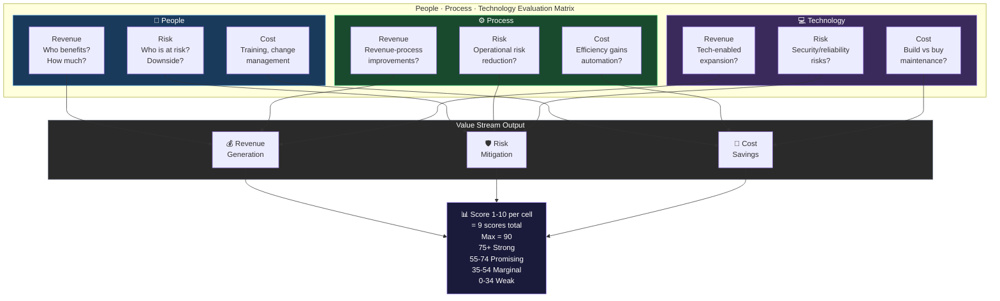
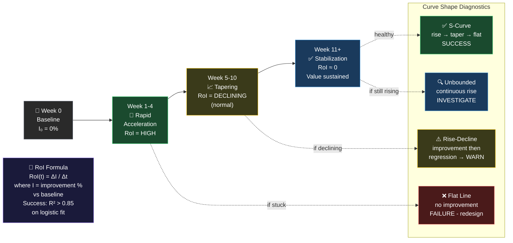
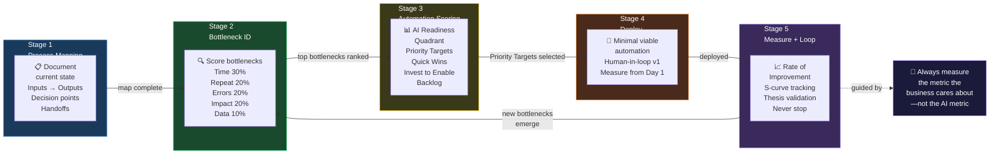
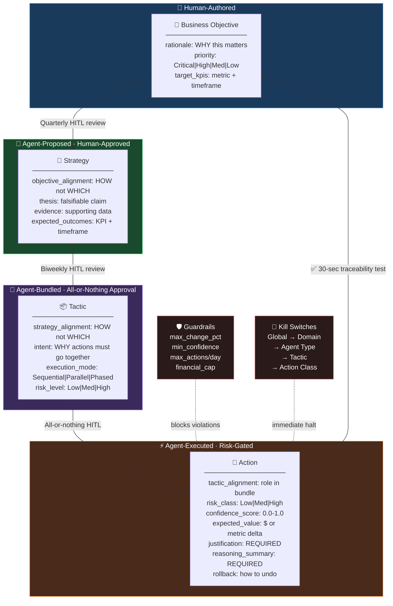
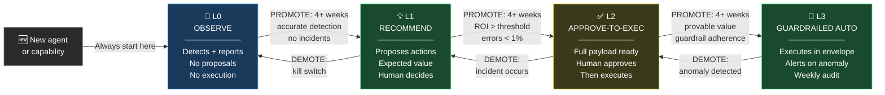

# PHILOSOPHY.md — Design Principles Reference

> The complete reference for all design principles encoded in this kit. Every skill, prompt, and template traces back to at least one principle here.

---

## Part 1: Core Decision Framework

### People · Process · Technology (PPT)

Every significant evaluation must address all three dimensions:

| Dimension | Key Questions |
|---|---|
| **People** | Who is affected? What skills are needed? What's the upside/downside per stakeholder group? What training is required? |
| **Process** | What workflows change? Where are the bottlenecks? What can be automated? What's the first-principles simplified version? |
| **Technology** | What tooling is needed? Integration complexity? Cost? Resilience? Innovation opportunity? |

**The rule:** If a recommendation doesn't address all three dimensions, it is incomplete.

<!-- DIAGRAM: ppt-value-streams START -->

<!-- DIAGRAM: ppt-value-streams END -->

### Three Value Streams

All work must connect to at least one:
- **Revenue Generation** — does this grow the top line or expand the addressable market?
- **Risk Mitigation** — does this reduce probability or impact of failure?
- **Cost Savings** — does this eliminate waste or reduce operating expense?

---

## Part 2: Operating Principles (Seed Documents)

### Pareto Principle (80/20 Rule)

20% of identified work is responsible for 80% of outcome value. Always identify this 20% first.

**Application:**
- In 30/60/90 planning: apply Pareto within each time bucket (Immediate/Soon/Later)
- In bottleneck analysis: the top 2–3 bottlenecks almost always account for 80% of friction
- In retrospectives: focus improvement energy on the top-weighted issues

*Source: Vilfredo Pareto; popularized in lean and agile contexts.*

### 30/60/90 Mindset

A system to organize activity and provide clarity on how to proceed.

| Horizon | Meaning | Focus |
|---|---|---|
| **30 (Immediate)** | Right now | Prototypes, "Hello World" tests, quick wins, unblocking |
| **60 (Soon)** | Near term | Core system, integration, team alignment |
| **90 (Long term)** | Later | Scaling, optimization, strategic positioning |

**How to build a 30/60/90 plan:**
1. Define: Vision / Objectives / Key Results / Stakeholders
2. Build the planning matrix (rows = dimensions, columns = time horizons)
3. Classify all activity into the appropriate time bucket
4. Apply Pareto within each bucket — start the 20% that delivers 80% of results

### Idea Evaluator

Comprehensive evaluation framework for any new idea or initiative.

**Scoring dimensions (1–10 each):**

| Dimension | What to Assess |
|---|---|
| **People — Revenue** | Who benefits? How? Revenue potential per user segment |
| **People — Risk** | Who is at risk? What's the downside? |
| **People — Cost** | Training, change management, headcount |
| **Process — Revenue** | How does this improve revenue-generating processes? |
| **Process — Risk** | Does this reduce operational risk? |
| **Process — Cost** | Efficiency gains, automation potential |
| **Technology — Revenue** | Tech-enabled revenue expansion |
| **Technology — Risk** | Security, reliability, integration risks |
| **Technology — Cost** | Build vs. buy, infrastructure, maintenance |

**Quantitative layer:**
- Total Addressable Market (TAM)
- Top 3 competitors: features, pricing, differentiators
- Conservative / Expected / Optimistic scenarios

### Firefighter

Rapid issue diagnosis and resolution pattern for critical situations.

**Steps:**
1. Map the highest-failure-probability components
2. Study code and test behavior under failure conditions
3. Own the root cause — don't stop at symptoms
4. Implement a permanent fix, not a patch
5. Assess PPT impact of the fix
6. Document findings and train the team

### Shake the Box

Pattern for unblocking stuck teams and creating forward momentum.

**Steps:**
1. Identify 3 easy wins — one each from Revenue, Risk, Cost
2. Apply Pareto: which win delivers the most momentum fastest?
3. Execute the wins visibly (show progress to team)
4. Use the momentum to introduce the moonshot vision
5. Sustain with 80/20 execution cadence

### Configuration-Driven Design

Design systems so behavior is controlled by external configuration, not hardcoded logic.

**Principles:**
- Externalize all configuration (YAML, JSON, config files)
- Separate process logic from implementation details
- Use rules engines for complex conditional logic
- Validate with small parameter sets before scaling
- Treat configuration itself as a deployable artifact (CI/CD the config)
- Democratize business rule management — let non-engineers manage rules

---

## Part 3: School of Titans Principles

### First Principles Reasoning

Break down a complex problem to its most fundamental elements, then reconstruct from the ground up.

**Process:**
1. Identify the problem
2. Strip all assumptions — question everything
3. Break to base elements (what is undeniably true?)
4. Question each element independently
5. Reconstruct from ground up
6. Validate reconstructed solution against original constraints

*Referenced by Elon Musk and Charlie Munger as their primary thinking tool.*

### Systems Over Goals

A system (repeatable process) reliably wins over a one-time goal.

- **Goal-focused people:** emotional roller-coaster depending on outcome
- **Systems-oriented people:** succeed every time they apply the process

*Model: Amazon's management leadership system — relentless forward progress that scales regardless of organization size. "Atomic Habits" by James Clear — systems > goals.*

**Application:** Build checklists, workflows, and repeatable patterns. Measure against process adherence, not just outcomes.

### Bias Towards Action

*"Speed matters in business. Many decisions and actions are reversible and do not need extensive study. We value calculated risk taking."* — Jeff Bezos

Every completed task reduces risk as you move toward a working solution. The first deployment is never final — ship and iterate.

**Anti-patterns to avoid:**
- Analysis paralysis (studying when you should be doing)
- Waiting for perfect information (80% confidence is usually enough)
- Over-engineering before validation

*"All of the really successful people I know have a really strong action bias. They just do things."* — Naval Ravikant

### Lead With Empathy

Authentic leadership is built on genuine care — for people's lives, challenges, and growth.

**Practice:**
1. Develop mindfulness — intentional focus without injecting bias or judgment
2. This produces: heightened self-awareness, unbiased judgment, accurate perception of others' emotional state
3. Which enables: genuine empathy, compassionate leadership, long-lasting relationships
4. Which produces: better team outcomes and psychological safety

### Radical Candor

The intersection of caring personally and challenging directly.

**Framework:**
1. Build psychological safety first
2. Give specific, timely praise (public)
3. Give criticism promptly and privately; focus on the behavior, not the person
4. Solicit feedback actively — create rituals for it
5. Track loop closure — did the feedback produce change?

### Knowledge Sprints

*"Forty hour workweeks are a relic of the Industrial Age. Knowledge workers function like athletes — train and sprint, then rest and reassess."* — Naval Ravikant

**Sprint system:**
- **Micro-sprint (60–90 min):** deep focus, no interruptions, one problem
- **Day-level sprint:** dedicate full days to a single type of work (coding day, meeting day, learning day)
- **Week-level sprint:** combine with 30/60/90 planning for structured progress
- **Combine with Pareto:** sprint on the 20% that matters most

### Persuasion Fundamentals

Six universal principles of influence (Robert Cialdini):

| Principle | Application |
|---|---|
| **Reciprocation** | Give value before asking for anything |
| **Commitment & Consistency** | Get small agreements first; people honor commitments |
| **Social Proof** | Show who else is doing it and succeeding |
| **Liking** | Build genuine rapport before making requests |
| **Authority** | Demonstrate expertise; cite credible sources |
| **Scarcity** | Highlight limited availability or time-sensitive opportunity |

### Moonshot Architecture

Design the ultimate future-state vision before constraining for current realities.

**Process:**
1. Design the "moonshot" with the entire team — include everyone in the design phase
2. Begin with system capabilities (Data Flow Diagram Level 0 — context diagram)
3. Progress through subsequent DFD levels, vetting concepts
4. Full team participation = individual buy-in + open forum for concerns
5. Validate against the **6 Pillars of Excellence** (AWS Well-Architected):
   - Operational Excellence · Security · Reliability · Performance Efficiency · Cost Optimization · Sustainability

### DevOps First

Democratize CI/CD — don't let deployment be a single person's responsibility.

- All engineers understand and can implement the CI/CD pipeline
- Build deployment capability early; standardize the process
- Democratize business rules — let business analysts and product owners manage rules via a rules engine
- Rules engines (e.g., Drools) keep business logic out of code and in the hands of domain experts

### Design Backwards

Start system design from the user output, then walk back to the data source.

1. Create dashboards first — what does each user role need to see?
2. Consider user roles: what's important to whom? How do they drill into detail?
3. Walk back through data flow to the source
4. Early end-user validation → higher probability of successful delivery

---

## Part 4: Operational Intelligence Principles

### Rate of Improvement Thesis

> Whatever AI workflow you build — measure the metric the business already cares about. The **rate of improvement on that metric** is the true measure of success.

**Expected deployment curve:**

| Phase | Timeline | What Happens |
|---|---|---|
| Rapid Acceleration | Weeks 1–4 | AI workflow deployed; quick wins captured; improvement rate spikes |
| Tapering | Weeks 5–10 | System optimizes; marginal gains decrease but absolute performance is high |
| Stabilization | Week 11+ | Rate flattens; AI workflow normalized into operations; steady-state value |

**Curve shape diagnostic:**
- ✅ Rapid rise → taper → flat = **SUCCESS** (system delivering sustained value)
- ⚠️ Rise → decline = **WARNING** (adoption issues or workflow misfit)
- ❌ Flat from start = **FAILURE** (wrong use case or bad implementation)
- 🔍 Continuous rise without taper = **INVESTIGATE** (measurement error or unsustainable)

**Math:** `RoI(t) = ΔI / Δt` (change in improvement per unit time). Success: R² > 0.85 on logistic/sigmoid fit.

<!-- DIAGRAM: rate-of-improvement-curve START -->

<!-- DIAGRAM: rate-of-improvement-curve END -->

### Operational Intelligence (OI) Operating Model

AI is not a tool — it is an **operational employee**: always on, always contributing, always measured on business metrics.

**Five stages:**
1. **Process Mapping** — document inputs, outputs, decision points, handoffs; quantify cycle times and error rates
2. **Bottleneck Identification** — score by: Time consumed (30%), Error frequency (20%), Repetitiveness (20%), Business impact (20%), Data availability (10%)
3. **Automation Scoring** — AI Readiness quadrant: Priority Targets / Quick Wins / Invest to Enable / Backlog
4. **Workflow Design & Deployment** — minimal viable automation; integrate into existing tools; keep human in the loop for v1; measure from day one
5. **Measurement & Continuous Loop** — Rate of Improvement framework; loop never stops

<!-- DIAGRAM: oi-operating-model START -->

<!-- DIAGRAM: oi-operating-model END -->

**OI Principles:**
1. Embed, don't bolt on — AI lives inside existing workflows
2. Measure business metrics, not AI metrics
3. Start with the bottleneck — find the biggest problem, then assess AI fit
4. Ship fast, iterate faster — the first version is never final
5. Document everything — every deployment produces a case study

### ROI Modeling

Three dimensions of AI deployment value:

| Dimension | Components |
|---|---|
| **Time Savings** | Hours reclaimed per week/month |
| **Cost Reduction** | Reduced labor, fewer errors, lower waste |
| **Revenue Acceleration** | Faster throughput, better conversion, higher capacity |

**Pre-deployment estimation formula:**
```
Annual Value = (Hours Saved/Week × Hourly Cost × 52) + (Error Reduction Value × 52)
```

Always present: Conservative / Expected / Optimistic scenarios.

---

## Part 5: Agentic OS Principles

### Governance Hierarchy

Every automated action must be traceable back to a human-authored business objective through a chain of explicit reasoning fields.

```
Business Objective  →  rationale field          (Why does this matter?)
       ↓
Strategy            →  objective_alignment field (How does it advance the objective?)
       ↓
Tactic              →  strategy_alignment + intent fields (How does it execute the strategy?)
       ↓
Action              →  tactic_alignment field    (What role does this action play?)
```

**The 30-second traceability test:** For any action, a human should trace it back to the business objective in under 30 seconds by reading the reasoning fields at each level.

<!-- DIAGRAM: governance-hierarchy START -->

<!-- DIAGRAM: governance-hierarchy END -->

**Quality rules for reasoning fields:**
- Say HOW, not just WHICH — alignment fields must explain causation, not just reference
- Specificity escalates downward — actions are more specific than tactics, tactics more than strategies
- No circular reasoning — "this advances the strategy by doing what the strategy says" is invalid

### Human-In-The-Loop (HITL) Design

| Level | Frequency | Mode |
|---|---|---|
| **Objective** | Quarterly / ad-hoc | Human-authored directly |
| **Strategy** | Biweekly / as proposed | Review + approve/reject/feedback |
| **Tactic** | As proposed | **All-or-nothing** — approve or reject the entire bundle |
| **Action** | Daily | By risk class: low = auto, medium/high = approval required |

### Guardrails and Kill Switches

**Guardrail types:** budget limits, pricing constraints, inventory thresholds, risk limits (confidence, action volume), autonomy limits.

**Guardrail enforcement:**
1. Agent proposes action with `expected_value`, `risk_class`, `confidence_score`
2. System checks: does the action fall within guardrails?
3. System checks: is data quality sufficient?
4. System checks: does the agent's autonomy level permit this action class?
5. Any failure → action **blocked** (not just flagged)

**Kill switch principles:**
1. Immediate effect — no queue drain; execution stops now
2. Explicit reactivation — humans must manually deactivate, never auto-clears
3. Audit trail — every activation/deactivation logged with user, timestamp, reason
4. Cascading scope — higher-level switch stops everything below it

### Autonomy Ladder (L0–L3)

| Level | Name | What Happens | When to Use |
|---|---|---|---|
| **L0** | Observe | Agent detects and reports only; no proposals | New agents, untested capabilities |
| **L1** | Recommend | Agent proposes actions with expected value and risk | Proven detection, unproven execution |
| **L2** | Approve-to-execute | Agent generates executable payload; runs only after human approval | Established action classes with HITL |
| **L3** | Guardrailed auto | Agent executes within guardrail envelope; alerts on anomalies | Proven track record (4+ weeks) |

<!-- DIAGRAM: autonomy-ladder START -->

<!-- DIAGRAM: autonomy-ladder END -->

**Promotion criteria** (all must be true for 4+ consecutive weeks):
- ROI > defined threshold (e.g., 5×)
- Error rate < defined threshold (e.g., 1%)
- No incidents attributable to automation

**Demotion triggers** (any one):
- Severe anomaly (unexpected spend spike, system failure)
- Incident attributable to automation
- Manual kill switch activation

### Tactic Design

A tactic is a bundle of actions with a **shared logical dependency** — their combined effect is greater than or different from the sum of individual effects.

**Bundle when:**
- Sequential dependency (B only makes sense after A)
- Risk mitigation (actions together are safer than alone)
- Timing sensitivity (actions must happen within the same window)
- Cross-domain coordination (two domains must act together for the outcome to work)

**Do NOT bundle when:**
- Actions are independent (different targets, no interaction)
- Convenience grouping (happen to be proposed together without logical dependency)
- You can't articulate WHY they must happen together

**Execution modes:**
- **Sequential** — order matters (cut first, then redirect)
- **Parallel** — all actions simultaneously (defensive bundles)
- **Phased** — natural stages (prepare → execute → measure)

### Confidence Scoring and Experiment Design

**Confidence scoring** (0.0–1.0, reflects data quality NOT importance):

| Score | Meaning |
|---|---|
| 0.9–1.0 | Complete, fresh data; strong pattern match → auto-execute proven actions |
| 0.7–0.8 | Good data, minor gaps; reasonable inference → standard HITL |
| 0.5–0.6 | Partial data; some evidence → flag for human evaluation |
| 0.3–0.4 | Limited data; educated guess → exploratory only |
| 0.0–0.2 | Very sparse/stale; speculative → review required, never auto-execute |

**Confidence reducers** (apply sequentially): data stale >48h (−0.1), sample <7 days (−0.1), first-time action type (−0.15), conflicting signals (−0.1), unaccounted external factors (−0.1).

**Experiment design pre-work** — design BEFORE executing:
- Hypothesis: "If we do X, then Y will change by Z%"
- Primary metric (the one that determines success)
- Success criteria (primary metric improves by ≥X% with p<0.05)
- Rollback trigger (if guardrail metric declines >Y% for N days)
- Duration (14 days minimum for most KPIs)

### Decision Rationale Requirement

Every significant agent output must include:
- `justification` — why this action was chosen over alternatives
- `reasoning_summary` — step-by-step chain-of-thought

Optional but valuable:
- `alternatives_considered` — what else was evaluated and why rejected
- `data_sources_used` — which inputs drove the decision
- `guardrail_evaluation` — how limits were checked

---

## Part 6: Operating Cadence

Combining all principles into a rhythm:

| Cadence | Duration | Key Activities |
|---|---|---|
| **Daily** | 15–30 min | Review brief, approve queued actions, execute bounded work, check traceability |
| **Weekly** | 60 min | KPI + Rate of Improvement review, 80/20 priority reset, automation ROI, experiment backlog |
| **Monthly** | 90 min | Budget + forecast, retrospective (PPT lens), objective review, playbook update, 30/60/90 refresh |
| **Quarterly** | Half-day | Moonshot vision refresh, autonomy ladder promotion/demotion, principle audit |
