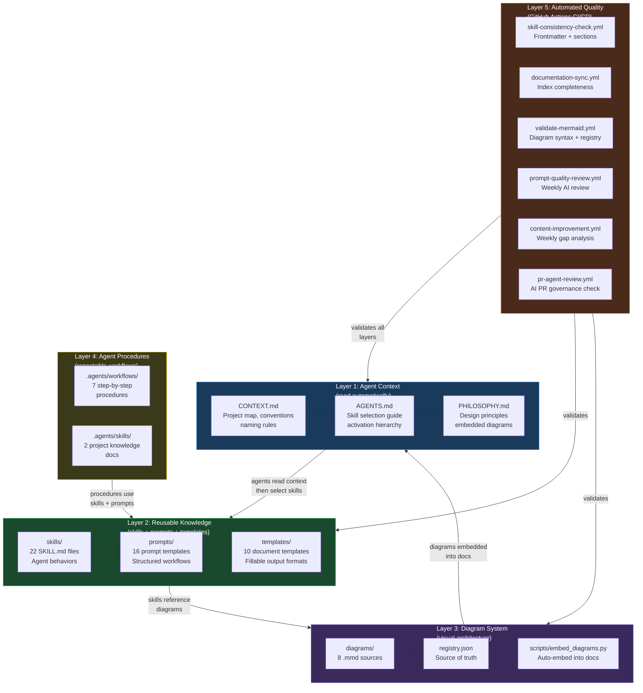

# Antigravity Kit — Architecture & Usage Guide

> **What:** The Antigravity Kit is a meta-layer of project infrastructure that makes AI coding agents (like Antigravity, Gemini, Copilot) dramatically more effective when working on this repository. It encodes design philosophy, repeatable procedures, and automated quality gates — so every AI session starts with full project context instead of discovery from scratch.

---

## Why This Exists

The agent-kernel contains 22 skills, 16 prompts, 10 templates, 9 diagrams, and 6 GitHub Actions workflows. Without a meta-layer, every time an AI agent starts a session it has to rediscover:

- Where things are and how they relate
- What naming conventions to follow (kebab-case directories, snake_case YAML keys)
- What design principles are encoded and how skills map to them
- How diagrams, configs, and docs stay in sync

The Antigravity Kit solves this by giving agents a **project map** (`CONTEXT.md`), a **skill selection guide** (`AGENTS.md`), **repeatable procedures** (`.agents/workflows/`), **project-specific knowledge** (`.agents/skills/`), and **automated quality gates** (`.github/workflows/`).

---

## Architecture

<!-- DIAGRAM: antigravity-kit-architecture START -->

<!-- DIAGRAM: antigravity-kit-architecture END -->

The kit is organized into five layers, each building on the one below:

| Layer | Purpose | State |
|---|---|---|
| **1. Agent Context** | Root files read by AI agents at session start | ✅ Active |
| **2. Reusable Knowledge** | Skills, prompts, and templates injected into work | ✅ Active |
| **3. Diagram System** | Visual architecture, auto-embedded into docs | ✅ Active |
| **4. Agent Procedures** | Step-by-step workflows triggered via slash commands | ✅ Active |
| **5. Automated Quality** | GitHub Actions for validation and AI-driven improvement | ⚙️ Enable with `GEMINI_API_KEY` |

---

## Layer 1: Agent Context

These root files are read by AI agents automatically at the start of every session.

| File | What It Does |
|---|---|
| [CONTEXT.md](../CONTEXT.md) | **Read first.** Project map, directory structure, naming conventions, slash commands, governance vocabulary, contribution rules. |
| [AGENTS.md](../AGENTS.md) | Skill selection guide — decision tree diagram + skill-to-task lookup tables across 5 categories. |
| [PHILOSOPHY.md](../PHILOSOPHY.md) | Full design principles reference (PPT, Pareto, 30/60/90, First Principles, OI Operating Model, Governance Hierarchy, Autonomy Ladder). 5 diagrams embedded inline. |
| [README.md](../README.md) | Human-readable overview with Quick Start table. |

**How agents use it:**
```
Session start → Read CONTEXT.md → Read AGENTS.md → Select skill → Read SKILL.md → Execute
```

---

## Layer 2: Reusable Knowledge

The core content library — 22 skills, 16 prompts, and 10 templates organized by domain.

### Skills (22)

Each skill lives at `skills/{skill-name}/SKILL.md` with required frontmatter (`name`, `description`, `when-to-use`, `principles`) and `## Agent Instructions` + `## Output Format` sections.

| Source | Skills |
|---|---|
| Seed Documents (7) | idea-evaluator, 30-60-90-planning, first-principles, firefighter, shake-the-box, configuration-driven-design, bias-towards-action |
| School of Titans (3) | lead-with-empathy, radical-candor, knowledge-sprints |
| OI Lab (4) | ai-use-case-scoring, business-data-analysis, outcome-probability, rate-of-improvement |
| Agentic OS (5) | governance-hierarchy-design, hitl-and-guardrails, autonomy-ladder, tactic-design, confidence-and-experiment |
| Kit Infrastructure (3) | diagram-design, domain-agent-design, agent-factory-design |

### Prompts (16)

Each prompt lives at `prompts/{purpose}.md` with required sections: `## Purpose`, `## When to Use`, `## Variables`, `## Prompt`, `## Expected Output`.

### Templates (10)

Fillable document and configuration templates at `templates/{purpose}.md` or `templates/{purpose}.yaml`.

---

## Layer 3: Diagram System

Visual architecture that stays in sync with documentation through an automated embed pipeline.

```
diagrams/*.mmd  →  registry.json  →  embed_diagrams.py  →  inline Mermaid in docs
```

### How It Works

1. **Source files** — Mermaid diagrams stored as `.mmd` in `diagrams/`
2. **Registry** — `diagrams/registry.json` maps each diagram to its embed targets
3. **Embed markers** — Target docs contain `<!-- DIAGRAM: id START -->` / `<!-- DIAGRAM: id END -->` markers
4. **Embed script** — `python3 scripts/embed_diagrams.py` replaces marker content with Mermaid fenced blocks
5. **Validation** — `make validate-mermaid` checks syntax; `.github/workflows/validate-mermaid.yml` runs on every push

### Current Diagrams (9)

| Diagram | What It Shows |
|---|---|
| `governance-hierarchy` | Objective → Strategy → Tactic → Action with HITL gates and guardrails |
| `autonomy-ladder` | L0–L3 with promotion criteria and demotion triggers |
| `rate-of-improvement-curve` | S-curve phases and diagnostic patterns |
| `ppt-value-streams` | PPT × Revenue/Risk/Cost evaluation matrix |
| `skill-selection-flow` | Decision tree for selecting the right skill by task type |
| `agent-architecture` | Single agent runtime: inputs → skills → model routing → safety → outputs |
| `agent-factory-evolution` | Era 1–4: Single Agent → Agent Factory → Hybrid → Factory of Factories |
| `oi-operating-model` | Five-stage OI operating cycle |
| `antigravity-kit-architecture` | This architecture — the five layers and their relationships |

### Commands

```bash
make embed-diagrams       # Populate all inline diagram markers
make validate-mermaid     # Check syntax on all .mmd files
make check-diagrams       # Dry-run embed (shows what would change)
```

See [docs/diagrams.md](diagrams.md) for the full diagram system reference.

---

## Layer 4: Agent Procedures

Step-by-step workflows that agents follow when triggered via slash commands. These enforce consistent patterns for every common operation.

### `.agents/workflows/` — 7 Procedures

| Slash Command | Workflow File | When to Use |
|---|---|---|
| `/add-skill` | [add-skill.md](../.agents/workflows/add-skill.md) | Creating a new skill with SKILL.md, frontmatter, and cross-references |
| `/add-prompt` | [add-prompt.md](../.agents/workflows/add-prompt.md) | Creating a new prompt with variables and expected output |
| `/add-template` | [add-template.md](../.agents/workflows/add-template.md) | Creating a new document or YAML template |
| `/add-diagram` | [add-diagram.md](../.agents/workflows/add-diagram.md) | Creating a Mermaid diagram, registering it, adding embed markers |
| `/update-philosophy` | [update-philosophy.md](../.agents/workflows/update-philosophy.md) | Adding or extending a design principle in PHILOSOPHY.md |
| `/run-consistency-check` | [run-consistency-check.md](../.agents/workflows/run-consistency-check.md) | Full audit for stale refs, missing fields, broken cross-references |
| `/inject-into-project` | [inject-into-project.md](../.agents/workflows/inject-into-project.md) | Injecting this kit into a downstream project |

**How to use:** Tell your AI agent `/add-skill` or `/run-consistency-check`. The agent reads the workflow file and follows every step.

### `.agents/skills/` — 2 Project Knowledge Docs

| Skill | What It Teaches |
|---|---|
| [project-navigation.md](../.agents/skills/project-navigation.md) | Where to find skills, prompts, templates, diagrams, workflows, docs |
| [schema-conventions.md](../.agents/skills/schema-conventions.md) | SKILL.md frontmatter rules, YAML schema conventions, governance fields |

---

## Layer 5: Automated Quality

GitHub Actions that validate the project on every push/PR and continuously improve it.

### Validation Workflows (always run — no secrets needed)

| Workflow | Trigger | What It Catches |
|---|---|---|
| `skill-consistency-check.yml` | Push to `skills/` or `prompts/` | Missing SKILL.md frontmatter fields, missing prompt sections |
| `documentation-sync.yml` | Push to content dirs | Skills/prompts/templates not referenced in AGENTS.md or project-navigation.md |
| `validate-mermaid.yml` | Push to `diagrams/` | Mermaid syntax errors, orphan .mmd files not in registry |

### AI-Powered Workflows (require `GEMINI_API_KEY` secret)

| Workflow | Trigger | What It Does |
|---|---|---|
| `prompt-quality-review.yml` | Weekly (Monday 9 AM) | AI reviews all prompts for clarity, philosophy alignment, output quality |
| `content-improvement.yml` | Weekly (Wednesday 9 AM) | Gap analysis — suggests missing skills and prompts based on philosophy coverage |
| `pr-agent-review.yml` | On every PR | AI checks for governance hierarchy consistency, traceability, frontmatter, banned patterns |

### How to Enable

**Validation workflows** run automatically — no setup needed.

**AI-powered workflows** require one secret:
```bash
# Add to GitHub repo: Settings → Secrets and Variables → Actions
GEMINI_API_KEY=your-gemini-api-key
```

### Local Validation

```bash
make all-checks           # Run consistency + mermaid validation
make consistency-check    # Validate SKILL.md frontmatter + prompt sections
make validate-mermaid     # Validate .mmd diagram syntax
make embed-diagrams       # Embed all diagrams into docs
```

---

## How It Benefits the Project

### For humans working with AI agents

| Before Antigravity Kit | After |
|---|---|
| Agent spends 10+ min exploring the project each session | Agent reads `CONTEXT.md` in seconds, knows where everything is |
| Agent doesn't know which skill applies to the task | `AGENTS.md` has a decision-tree diagram and lookup tables |
| Agent invents its own naming conventions | `CONTEXT.md` enforces kebab-case, snake_case, and frontmatter rules |
| No standard process for adding skills, prompts, diagrams | 7 slash-command workflows enforce consistent patterns every time |
| Diagrams go stale as docs are updated | Embed system keeps diagram sources and inline copies in sync |

### For CI/CD

| Before | After |
|---|---|
| Skills missing required frontmatter fields | `skill-consistency-check.yml` blocks the PR |
| Diagrams with syntax errors break rendering | `validate-mermaid.yml` catches errors before merge |
| New skills/prompts not listed in AGENTS.md | `documentation-sync.yml` reports missing references |

### For continuous improvement

| Before | After |
|---|---|
| Prompt quality degrades over time without review | Weekly AI review checks every prompt against philosophy |
| Missing skills go unnoticed for months | Weekly gap analysis identifies what's missing |
| PR reviews miss governance and traceability issues | AI PR reviewer checks every PR for consistency |

---

## Quick Reference

### Starting a session

1. AI agent reads `CONTEXT.md` → gets project map
2. Agent reads `AGENTS.md` → selects the right skill for the task
3. Agent reads `skills/{skill-name}/SKILL.md` → follows the instructions
4. Agent uses the matching prompt and/or template to produce output

### Common slash commands

```
/add-skill                 Create a new SKILL.md following conventions
/add-prompt                Create a new prompt template
/add-diagram               Create a .mmd diagram + registry entry + embed markers
/run-consistency-check     Full audit for stale references and missing fields
/inject-into-project       Inject this kit into another repository
```

### Files at a glance

```
CONTEXT.md                 # Root project map (agents read this first)
AGENTS.md                  # Skill selection guide with decision tree
PHILOSOPHY.md              # Full design principles (5 diagrams embedded)

skills/                    # 22 SKILL.md files (reusable agent behaviors)
prompts/                   # 16 prompt templates (structured AI workflows)
templates/                 # 10 document/config templates (fillable output formats)

diagrams/                  # 9 .mmd Mermaid sources + registry.json
scripts/                   # embed_diagrams.py (auto-embed pipeline)
Makefile                   # validate-mermaid, embed-diagrams, consistency-check

.agents/workflows/         # 7 step-by-step procedures (slash commands)
.agents/skills/            # 2 project knowledge documents

.github/workflows/         # 6 GitHub Actions (3 validation + 3 AI-powered)

docs/                      # Human documentation (contributing, injection, diagrams, this file)
```
