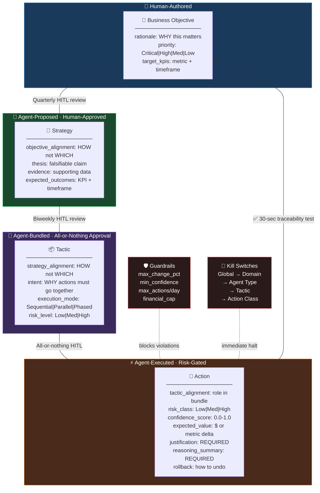
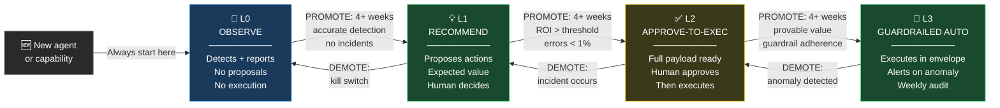
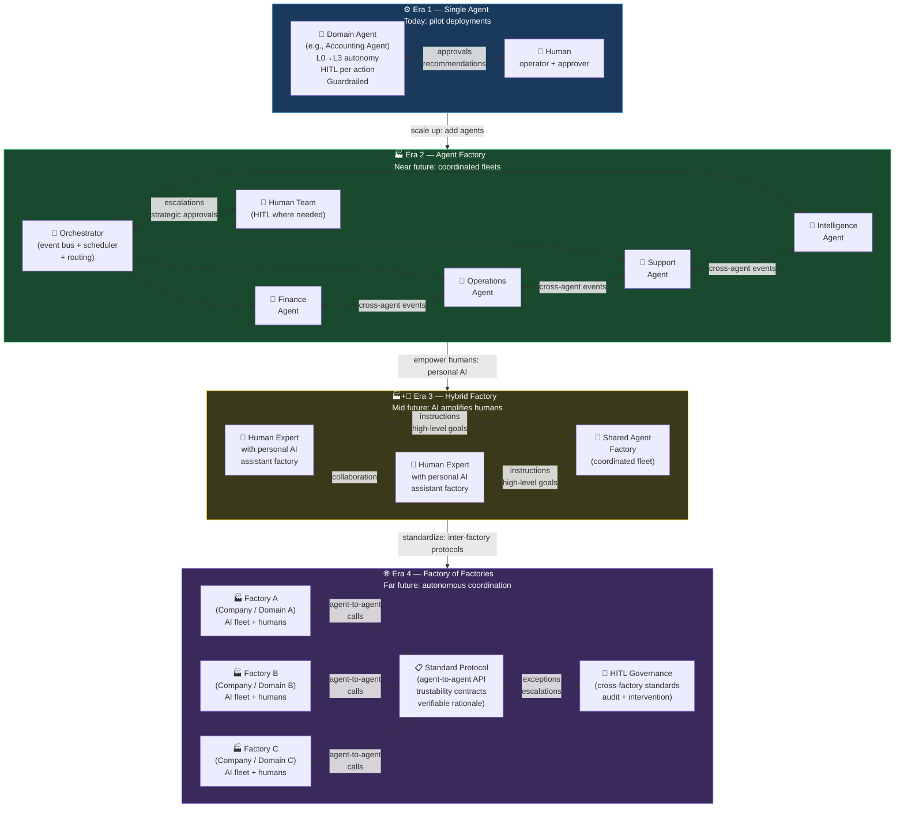

# docs/design-principles.md

# Design Principles Reference

This is the condensed reference for all principles encoded in the agent-kernel. For the full documentation, see [PHILOSOPHY.md](../PHILOSOPHY.md).

---

## Quick Reference Card

### The Four Operating Principles

| Principle | One-Line Summary | Primary Use |
|---|---|---|
| **Pareto (80/20)** | 20% of work delivers 80% of value — find that 20% | Prioritization, planning |
| **30/60/90** | Immediate / Soon / Later — map everything to a horizon | Planning, goal-setting |
| **First Principles** | Strip all assumptions, rebuild from base elements | Problem-solving, design |
| **Bias Towards Action** | A good decision now beats a perfect decision later | Execution, anti-paralysis |

### The PPT Evaluation Trifecta

Every significant decision must address all three dimensions:

```
People    → Who is affected? Skills needed? Change management?
Process   → What workflows change? Where are the bottlenecks?
Technology → What tooling? Integration complexity? Build vs. buy?
```

### Three Value Streams

Every output should connect to at least one:
- 💰 **Revenue Generation** — grow the top line
- 🛡️ **Risk Mitigation** — reduce probability or impact of failure
- 💸 **Cost Savings** — eliminate waste or reduce operating expense

---

## Principle Lookup by Situation

| Situation | Best Principle |
|---|---|
| "We're overanalyzing and not doing anything" | Bias Towards Action |
| "Everything feels equally important" | Pareto (80/20) |
| "We have no idea where to start" | 30/60/90 + Pareto |
| "The conventional solution isn't working" | First Principles |
| "The team is stuck and demoralized" | Shake the Box |
| "We need to make a major decision" | PPT Assessment |
| "We need to measure AI impact" | Rate of Improvement |
| "We need to deploy an autonomous agent safely" | Governance Hierarchy + HITL |
| "An agent is making too many unchecked decisions" | Autonomy Ladder + Guardrails |
| "Our actions aren't traceable back to objectives" | Traceability Contract |

---

## Governance Hierarchy Summary

```
Business Objective (human-authored quarterly)
         ↓  objective_alignment
Strategy (agent-proposed, human-approved biweekly)
         ↓  strategy_alignment + intent
Tactic (action bundle, all-or-nothing approval)
         ↓  tactic_alignment
Action (atomic execution, risk-gated)
```

**30-second traceability test:** Every action must trace to an objective in under 30 seconds.

<!-- DIAGRAM: governance-hierarchy START -->

<!-- DIAGRAM: governance-hierarchy END -->

## Autonomy Ladder Summary

| Level | Name | Executes? | When |
|---|---|---|---|
| L0 | Observe | ❌ Never | New, unknown capabilities |
| L1 | Recommend | ❌ Proposes only | Proven detection, unproven execution |
| L2 | Approve-to-Execute | ✅ With human approval | Established with HITL |
| L3 | Guardrailed Auto | ✅ Within envelope | Proven track record (4+ weeks) |

<!-- DIAGRAM: autonomy-ladder START -->

<!-- DIAGRAM: autonomy-ladder END -->

## Rate of Improvement Summary

```
Deploy → Measure the metric the business cares about → Track weekly
Expected curve: Rapid rise → Taper → Stable (S-curve = SUCCESS)
```

Formula: `RoI(t) = ΔI/Δt` — rate of improvement per time period.

<!-- DIAGRAM: rate-of-improvement-curve START -->
<!-- DIAGRAM: rate-of-improvement-curve END -->

<!-- DIAGRAM: agent-factory-evolution START -->

<!-- DIAGRAM: agent-factory-evolution END -->

---

*For the full documentation of each principle, see [PHILOSOPHY.md](../PHILOSOPHY.md).*
