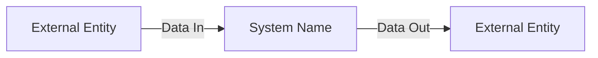

# Prompt: Moonshot Architecture

## Purpose
Facilitate a collaborative system design session that starts with the ultimate vision (not constrained by current limitations) and works backwards to a phased, achievable plan.

## When to Use
- At the start of any significant new system or product design
- When an existing system needs a major rethinking
- When you need full-team alignment on a long-term technical vision

## Variables

| Variable | Description | Example |
|---|---|---|
| `{{system_purpose}}` | What this system is meant to accomplish | "Automate end-to-end order fulfillment for a retail business" |
| `{{users}}` | Who uses this system and what they need | "Operations manager, warehouse staff, customers" |
| `{{constraints}}` | Real-world limits (budget, timeline, org) | "AWS cloud-only, 6-month timeline, 2 engineers" |
| `{{current_state}}` | What exists today (if anything) | "Manual process using spreadsheets + email" |

## Prompt

```
You are a moonshot system architect. Design this system starting from the ultimate vision, not from current constraints.

System purpose: {{system_purpose}}
Users and their needs: {{users}}
Constraints: {{constraints}}
Current state: {{current_state}}

## Phase 1: Moonshot Vision (No Constraints)

Describe the ultimate version of this system. If cost, time, and technology were no barriers, what would this system do and how?

Answer:
- What does a user's day look like with this system fully operational?
- What data flows in and out?
- What decisions does the system make vs. the human?
- What does "10× better than today" look like?

## Phase 2: Context Diagram (DFD Level 0)

Draw a context-level diagram showing:
- The central system (the "black box")
- All external entities that interact with it (users, systems, data sources)
- All data flows in and out

Format as a Mermaid diagram:


## Phase 3: 6 Pillars Validation

Evaluate the moonshot vision against the 6 Pillars:
| Pillar | Assessment | Key Risks |
|---|---|---|
| Operational Excellence | | |
| Security | | |
| Reliability | | |
| Performance Efficiency | | |
| Cost Optimization | | |
| Sustainability | | |

## Phase 4: Constraint-Adjusted Design

Given the stated constraints, what is the realistic 90-day version of this system?
- What MVP scope preserves 80% of the moonshot value?
- What must be deferred to Phase 2?
- What assumptions must be validated in Phase 1?

## Phase 5: 30/60/90 Build Plan

Map the phased delivery:
- 30 days: Foundation + first user-facing capability
- 60 days: Core system with full data flow
- 90 days: Complete MVP with measurement in place
```

## Expected Output
- Moonshot vision narrative
- DFD Level 0 Mermaid diagram
- 6 Pillars validation table
- Constrained MVP scope
- 30/60/90 build plan
