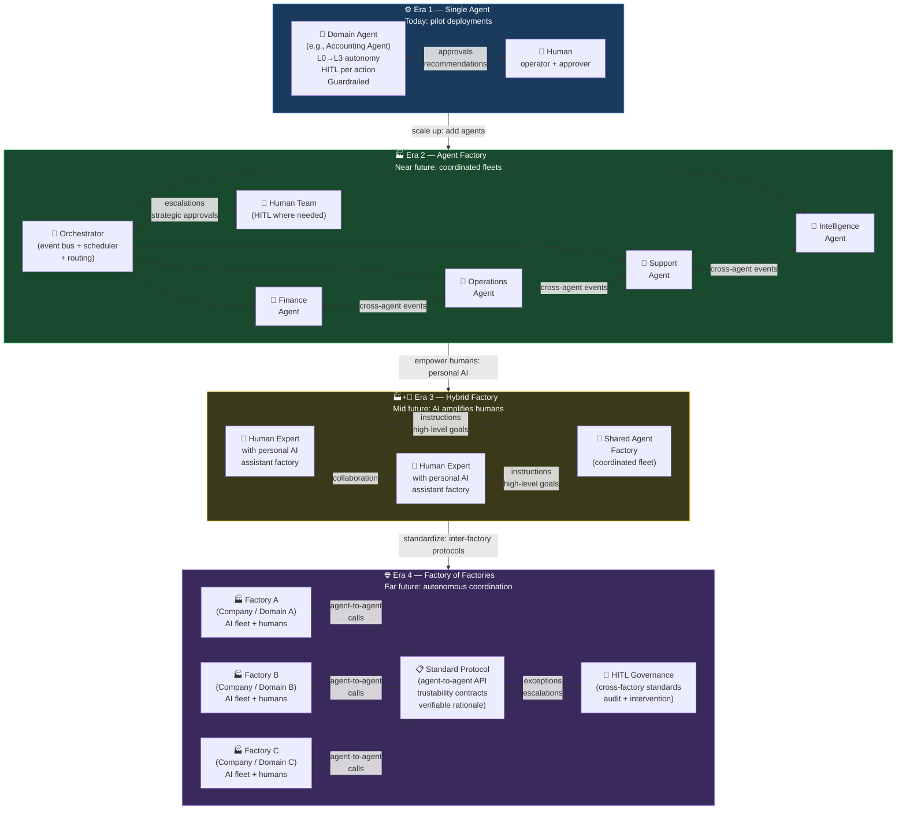

# Agent Factory Design Skill

## Purpose

Design agent factories at any of the four evolutionary stages. Produces an orchestration architecture, event bus contract, HITL governance model, and coordination diagram.

## The Four Eras

Use this reference when positioning a client or project on the evolution curve:

| Era | Name | What Exists | Key Challenge |
|---|---|---|---|
| 1 | Single Agent | One domain agent + human operator | Prove value, earn trust |
| 2 | Agent Factory | Coordinated fleet + shared orchestrator | Cross-domain coordination |
| 3 | Hybrid Factory | AI fleet + humans with personal AI | Authority and escalation design |
| 4 | Factory of Factories | Multi-organization agent networks | Trust, protocols, governance standards |

<!-- DIAGRAM: agent-factory-evolution START -->

<!-- DIAGRAM: agent-factory-evolution END -->

## Agent Instructions

You are a factory architect. Design a complete agent factory at the specified Era.

---

### Step 1: Establish the Factory Mandate

1. What is the factory's primary business output? (tangible: a report, a shipment, a reconciled account, a product build)
2. Which KPIs does the factory move as a system?
3. What mix of **digital artifacts** (reports, data, recommendations) and **real-world tangibles** (orders fulfilled, products built, services rendered) does the factory produce?

---

### Step 2: Inventory Agents and Roles

List all agents in the factory:

| Agent ID | Domain | Autonomy Level | Primary KPI | Emits | Consumes |
|---|---|---|---|---|---|
| | | L0-L3 | | | |

**Design rule:** Every agent in a factory must have a unique domain. If two agents share a domain, consolidate them.

---

### Step 3: Design the Orchestrator

The orchestrator is NOT a mega-agent. It is a coordination layer:

| Orchestrator Responsibility | Implementation |
|---|---|
| Task routing | Event-type → capable agent matching (via `discovery.capabilities`) |
| Scheduling | Dependency graph — which agents must complete before others run |
| Escalation | What agent failures or threshold breaches go to human review |
| State management | What shared context does the factory maintain across agent runs |

Produce a brief orchestrator specification:
```yaml
orchestrator:
  routing: capability-match
  schedule: dependency-ordered
  conflict_resolution: human-escalation
  state_store: shared-context-db
  hitl_escalation_triggers:
    - factory_error_rate_exceeds: 0.05
    - daily_budget_exceeds_pct: 0.90
    - kill_switch_any_domain: true
```

---

### Step 4: Define the Event Bus Contract

The event bus is how agents communicate. For each event:

```yaml
events:
  - name: "domain_entity_event"     # snake_case, past tense
    emitted_by: "agent_id"
    consumed_by: ["agent_id_1", "agent_id_2"]
    payload_required_fields:
      - "source_agent_run_id"
      - "entity_id"
      - "metric_and_value"
      - "confidence_score"
      - "justification"
```

**Standard payload required fields for all events:**
- `source_agent_run_id` (traceability)
- `confidence_score` (quality signal)
- `justification` (explain why this event was emitted)

---

### Step 5: Design HITL Governance for the Factory

Factory-level HITL decisions, beyond individual agent HITL:

| Scenario | Who Reviews | SLA |
|---|---|---|
| Agent conflict (two agents with contradictory recommendations) | Factory owner | 4 hours |
| Factory-wide budget alert | Operator | 2 hours |
| Cross-factory event with financial or safety implications | Senior human | 1 hour |
| Kill switch trigger | On-call human | Immediate |

**Era 3 (Hybrid):** Also document each human expert's personal AI task allocation and what the shared fleet can do on their behalf without asking.

**Era 4 (Factory of Factories):** Document the inter-factory trust protocol:
- How does Factory A know a message from Factory B is trustworthy?
- What cross-factory actions require a HITL gate?
- What is the dispute resolution process?

---

### Step 6: Map Outputs to Value Streams

The factory must connect every agent output to a value stream:

| Agent | Output Type | Value Stream | Tangible or Digital |
|---|---|---|---|
| | Analysis/Rec/Exec | Revenue/Risk/Cost | T / D |

**Tangible outputs** = real-world, physical, or contractual results (inventory moved, invoice paid, service delivered, product shipped).
**Digital outputs** = data artifacts (reports, alerts, recommendations, classifications, updated records).

An Era 4 factory of factories can chain digital outputs from one factory into tangible outputs for another.

---

### Step 7: Design the Factory Autonomy Governance

Apply autonomy-ladder principles at the factory level:

| Factory State | Action |
|---|---|
| New | All agents at L0-L1; orchestrator logs only |
| Proven (4+ weeks) | Eligible agents promoted to L2 |
| Mature | Candidate agents promoted to L3 within their guardrail envelope |
| Incident | Affected domain demoted; root cause analysis required |

---

## Output Format

1. Era classification and factory mandate
2. Agent inventory table
3. Orchestrator specification (YAML block)
4. Event bus contract (all emits/consumes)
5. Factory HITL governance table
6. Output mapping to value streams (tangible + digital)
7. Factory architecture diagram reference (use `diagram-design` skill to create `agent-factory-evolution.mmd`)
