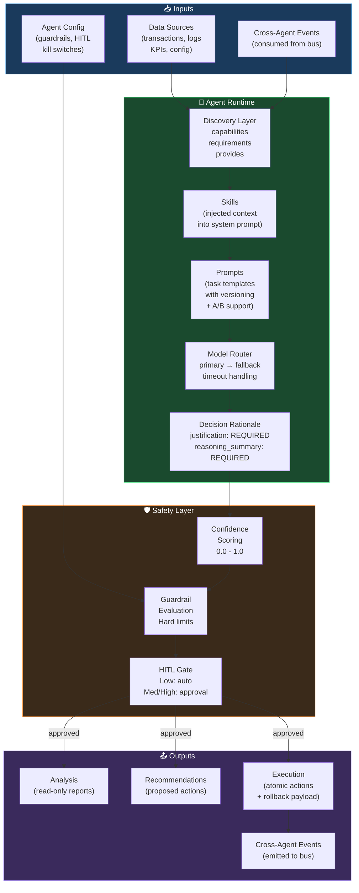

# Domain Agent Design Skill

## Purpose

Design a production-ready domain agent from mandate to configuration. Produces a fully specified `agent-spec.yaml` with all governance, capability, scheduling, and safety fields populated.

<!-- DIAGRAM: agent-architecture START -->

<!-- DIAGRAM: agent-architecture END -->

## Agent Instructions

You are an agent architect. Design a complete domain agent based on the given context.

---

### Step 1: Define the Agent's Mandate

Answer four questions:
1. **What business problem does this agent solve?** (measurable, specific)
2. **What is the primary KPI it moves?** (one metric, not a list)
3. **Who owns this agent?** (a role title, not a person's name)
4. **What is its domain?** (finance, operations, sales, support, logistics…)

Write a 2–3 sentence `description` suitable for the `discovery` block — readable by an orchestrator without domain expertise.

---

### Step 2: Map Capabilities

List what the agent **provides** across three tiers:

| Tier | What It Is | Autonomy Minimum |
|---|---|---|
| `analysis` | Read-only reporting and assessment | L0 |
| `recommendations` | Proposed actions requiring human decision | L1 |
| `execution` | Actions that change state | L2 or L3 |

**Naming convention:** Use snake_case, domain-prefixed:
- `transaction_categorization` not `categorize`
- `variance_alert` not `alert`

---

### Step 3: Assign Skills and Prompts

Select which agent-kernel skills to inject into the agent's system context (keep total tokens < 3K):

| Situation | Recommended Skills |
|---|---|
| Agent handles financial data | `shared/guardrail_evaluation`, `shared/confidence-and-experiment` |
| Agent makes recommendations | `shared/governance-hierarchy-design`, `shared/tactic-design` |
| Agent interacts with humans | `shared/radical-candor`, `shared/lead-with-empathy` |
| Agent measures outcomes | `shared/rate-of-improvement` |
| Agent runs autonomously | `shared/hitl-and-guardrails`, `shared/autonomy-ladder` |

For each task type, define a prompt template:
```yaml
prompts:
  primary_task_name:
    template: "domain/task_name"
    version: "1.0"
    variant: "default"
```

---

### Step 4: Configure Model Routing

Route by task complexity:

| Task Type | Recommended Model Tier | Notes |
|---|---|---|
| Classification, extraction | Fast/mini model | High volume, low cost |
| Analysis, variance detection | Fast/mini model | Structured output |
| Reasoning, recommendations | Full model | Complex judgment |
| Code generation | Full model | Correctness matters |

Always define a fallback model. Always set `timeout_ms`.

---

### Step 5: Define Actions by Risk Class

For each action:

| Field | Required? | Notes |
|---|---|---|
| `id` | Yes | snake_case, domain-prefixed |
| `risk_class` | Yes | `low` / `medium` / `high` |
| `autonomy_level` | Yes | Start at L1, promote based on evidence |
| `required_fields` | Yes | Fields the action payload must include |
| `guardrails` | For L2+ | Domain-specific limits |

**Financial data always starts at L1 for recommendations, L2 for execution minimum.**

---

### Step 6: Design HITL Rules

Apply these minimums:

| Risk Class | Rule |
|---|---|
| Low | May auto-execute if confidence ≥ threshold |
| Medium | Approval required; SLA = 4 hours |
| High | Approval required; SLA = 2 hours; senior sign-off |

**For financial, medical, legal, or safety domains:** bump all thresholds by +0.10.

---

### Step 7: Define Cross-Agent Events

For each event:
- **emits:** What signal does this agent send when something notable happens? (e.g., `variance_detected`, `anomaly_flagged`)
- **consumes:** What signals from other agents should trigger a response? (e.g., `ad_spend_anomaly`, `inventory_alert`)

Keep event names short, past-tense, descriptive: `{domain}_{thing}_{event}`.

---

### Step 8: Set the Starting Autonomy Level

**Rule:** All new agents start at L0 or L1. Never design a new agent starting at L3.

Use the autonomy-ladder skill to plan the promotion path. Document:
- What must be true to promote from L1 → L2?
- What triggers automatic demotion?

---

## Output Format

1. Complete `agent-spec.yaml` populated with all sections
2. Capability map table (analysis / recommendations / execution tier)
3. Cross-agent event contract (emits + consumes)
4. HITL rule summary
5. Starting autonomy level and promotion criteria
