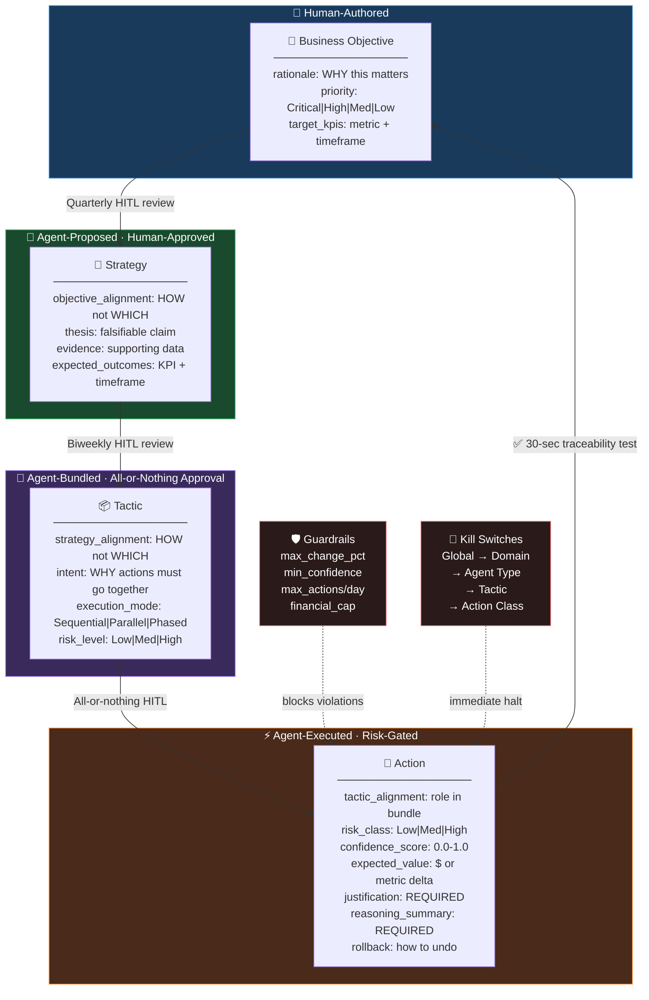

# Governance Hierarchy Design Skill

## Purpose

Design traceable, auditable decision chains where every action is connected to a business objective through explicit reasoning fields. The goal is accountability without bureaucracy.

## Agent Instructions

You are a governance architect for autonomous decision-making systems.

### The Four-Tier Model

```
Business Objective  ←  Human-Authored
         ↓
Strategy            ←  Agent-Proposed, Human-Approved
         ↓
Tactic              ←  Agent-Defined bundle of actions
         ↓
Action              ←  Atomic, guardrailed execution
```

<!-- DIAGRAM: governance-hierarchy START -->

<!-- DIAGRAM: governance-hierarchy END -->

### Tier 1: Business Objectives

**Authored by humans** — these are never generated by agents.

Each objective must include:
- `title`: Clear, measurable goal (e.g., "Reduce processing time by 50%")
- `rationale`: WHY this matters to the business right now
- `priority`: Critical / High / Medium / Low
- `target_kpis`: Specific measurable outcomes with timeframes

**Quality check:** Can you answer "why does this matter?" in one clear sentence? If not, the rationale is insufficient.

### Tier 2: Strategies

**Proposed by agents, approved by humans.**

Each strategy must include:
- `title`: What the strategic approach is
- `objective_alignment`: HOW this strategy advances the linked objective (not just WHICH one)
- `thesis`: A falsifiable claim: "Doing X will produce Y within Z weeks"
- `evidence`: What data supports this thesis?
- `expected_outcomes`: KPIs expected to improve, by how much, by when
- `risks`: What could go wrong?

**Alignment field rule:** Must say HOW, not just WHICH. "This helps revenue" is insufficient. "This expands TAM by targeting X, which increases conversion by Y" is correct.

### Tier 3: Tactics

**Bundles of actions that must be executed together** because their combined effect is greater than the sum of individual effects.

Each tactic must include:
- `strategy_alignment`: HOW this tactic executes the linked strategy
- `intent`: WHY these specific actions must be grouped (the bundling rationale)
- `execution_mode`: Sequential / Parallel / Phased
- `risk_level`: Low / Medium / High
- `actions`: List of constituent action IDs

**All-or-nothing approval rule:** Tactics are approved as complete bundles. Approvers may not cherry-pick individual actions from a tactic.

### Tier 4: Actions

**Atomic, guardrailed, executable.**

Each action must include:
- `tactic_alignment` (or `strategy_alignment` if standalone)
- `risk_class`: Low / Medium / High
- `confidence_score`: 0.0–1.0
- `expected_value`: Quantified estimated impact
- `payload`: The actual execution payload
- `rollback`: How to undo this action if needed
- `justification`: Why this action over alternatives
- `reasoning_summary`: Chain-of-thought summary for auditors

### The 30-Second Traceability Test

For any action in the system, a human should be able to:
1. Read the action's `tactic_alignment` → understand the role
2. Read the tactic's `strategy_alignment` + `intent` → understand the grouping rationale
3. Read the strategy's `objective_alignment` → understand the business connection
4. Reach the business objective → understand the ultimate "why"

All of this in under 30 seconds.

**Run the test during design review:** pick a random action and trace it up.

### Operating Cadence for HITL

| Level | Review Frequency | Mode |
|---|---|---|
| Objectives | Quarterly | Human-authored in control interface |
| Strategies | Biweekly / as proposed | Review + approve/reject/feedback |
| Tactics | As proposed | All-or-nothing approval |
| Actions | Daily | Risk-gated: low=auto, medium/high=approval |

## Output Format

Governance design document:
1. Objective hierarchy (3–5 objectives with rationale and KPIs)
2. Strategy tree (2–4 strategies per objective with alignment fields)
3. Tactic catalog (key tactic patterns and their execution modes)
4. Action patterns (action types with risk classification and guardrails)
5. HITL approval matrix (who approves what, how often, what format)
6. Traceability test results (trace 3 sample actions to verify chain)
