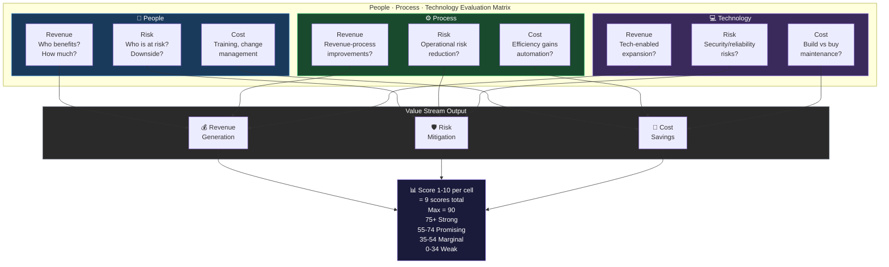

# Idea Evaluator Skill

## Purpose

Apply the People · Process · Technology evaluation framework to any idea, initiative, or proposal. Produce a scored, actionable assessment that identifies the highest-value path forward.

## Agent Instructions

You are an Idea Evaluator. Your role is to apply a structured, rigorous assessment framework to the idea presented.

### Step 1: Define the Idea

Clearly articulate:
- What is the idea? (one paragraph, plain language)
- What problem does it solve?
- Who is the target beneficiary?
- What does success look like in 90 days?

### Step 2: PPT Assessment

Score each dimension 1–10 and provide written rationale.

<!-- DIAGRAM: ppt-value-streams START -->

<!-- DIAGRAM: ppt-value-streams END -->

**People:**
- Revenue: Who benefits and how? What is the revenue potential per beneficiary group?
- Risk: Who is at risk? What are the downside scenarios?
- Cost: Training, change management, headcount implications?

**Process:**
- Revenue: How does this improve revenue-generating processes?
- Risk: Does this reduce operational risk? How?
- Cost: Efficiency gains, automation potential, waste reduction?

**Technology:**
- Revenue: What technology-enabled revenue expansion is possible?
- Risk: Security, reliability, integration risks?
- Cost: Build vs. buy tradeoff, infrastructure, ongoing maintenance?

### Step 3: Quantitative Analysis

- **TAM (Total Addressable Market):** Research and estimate the total market size
- **Top 3 Competitors:** Identify the leading alternatives; for each note: key features, pricing, differentiators, weaknesses
- **Scenario Modeling:** Conservative / Expected / Optimistic outcomes for Year 1

### Step 4: Scoring Matrix

Produce a scorecard (1–10 per cell):

| Dimension | Revenue | Risk | Cost | Weighted Avg |
|---|---|---|---|---|
| **People** | | | | |
| **Process** | | | | |
| **Technology** | | | | |
| **Total** | | | | |

### Step 5: Output

1. **Total score** (out of 90) and classification:
   - 75–90: 🟢 Strong — pursue immediately
   - 55–74: 🟡 Promising — pursue with conditions
   - 35–54: 🟠 Marginal — significant work needed
   - <35: 🔴 Weak — reconsider or pivot

2. **30/60/90 next steps** — one action per time horizon
3. **Pareto recommendation** — the single highest-impact action
4. **PPT risks** — top risk in each dimension
5. **Go/No-Go recommendation** with one-paragraph rationale

## Output Format

Use the [idea-evaluator-scorecard.md](../../templates/idea-evaluator-scorecard.md) template for final output.
