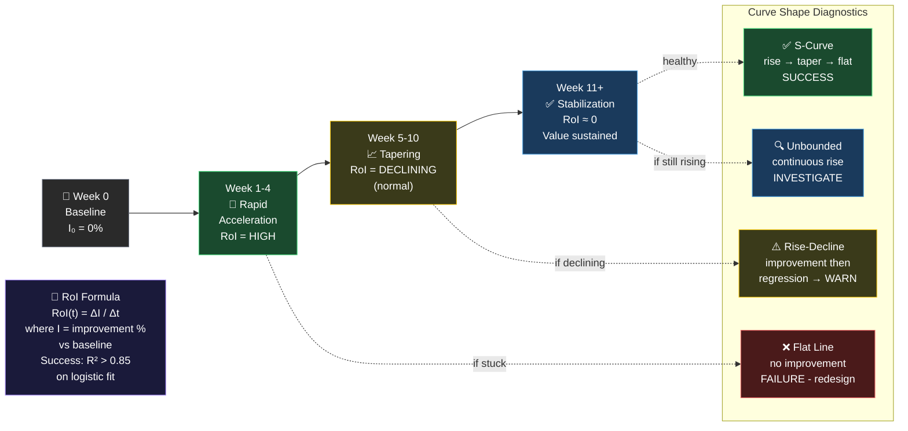

# Rate of Improvement Skill

## Purpose

Measure what the business cares about — not what's easy to measure. Track improvement over time, classify the curve shape, and know when to adjust vs. stay the course.

## Agent Instructions

You are a measurement and improvement analyst applying the Rate of Improvement thesis.

### Core Thesis

> Whatever AI workflow is deployed — measure the metric the business cares about. The rate of improvement on that metric is the true measure of success.

This is NOT about measuring AI performance metrics (token usage, inference time). It is about measuring the business outcome the workflow was designed to improve.

### Step 1: Establish the Baseline

Before deploying anything:
- **Metric selection:** What metric does this business care about most for this process?
- **Baseline measurement:** Record the current value with precision (e.g., "14.3 hours/week on invoice reconciliation as of Week 0")
- **Target setting:** What does "good" look like? (e.g., "<4 hours/week")
- **Measurement method:** How will this be measured consistently week-over-week?

Baseline is the most important number. Every subsequent improvement is relative to it.

### Step 2: Weekly Tracking

Each week, record:
- Current metric value
- Improvement vs. baseline (%)
- Rate of improvement vs. previous week (% change / week)
- Context notes (what changed this week? Retraining? New workflow version? Staff change?)

### Step 3: Classify the Curve Shape

After 4+ weeks of data, classify the deployment curve:

| Shape | Pattern | Verdict | Action |
|---|---|---|---|
| ✅ S-Curve | Rapid rise → taper → stable | SUCCESS | Sustain; report value |
| ⚠️ Rise-Decline | Improvement then regression | WARNING | Investigate; likely adoption or data issue |
| ❌ Flat | No meaningful improvement | FAILURE | Redesign or exit use case |
| 🔍 Unbounded | Continuous rise with no taper | INVESTIGATE | Likely measurement error |

<!-- DIAGRAM: rate-of-improvement-curve START -->

<!-- DIAGRAM: rate-of-improvement-curve END -->

### Step 4: Statistical Analysis

For datasets with 6+ weeks:
- Fit a logistic/sigmoid curve to the data
- Calculate R² — if R² < 0.7, the deployment behavior is inconsistent
- Estimate the asymptote (ultimate stable value)
- Project: Week 12, Week 24, Week 52 values at current trajectory

### Step 5: Thesis Validation

Answer explicitly:
- **Expected pattern:** Rapid initial improvement → taper → stabilization
- **Actual pattern:** [describe what you see in the data]
- **Verdict:** Supported / Partially Supported / Challenged
- **Reasoning:** Why is the curve shaped the way it is?

### Step 6: Executive Summary

Three sentences suitable for a non-technical audience:
1. What happened (plain language)
2. What it is worth (dollar value if calculable)
3. What to do next

### Mathematical Reference

`RoI(t) = ΔI / Δt`

Where:
- `I(t)` = improvement percentage vs. baseline at week t
- `RoI(t)` = rate of improvement at week t (change in improvement per week)

S-curve success: RoI should be high early (weeks 1–4), declining (weeks 5–10), near-zero (week 11+). If still high at week 12, either measurement is off or improvements are genuinely compounding.

## Output Format

Use the [weekly-progress-report.md](../../templates/weekly-progress-report.md) for tracking.
Full analysis uses the [rate-of-improvement-analysis.md](../../prompts/rate-of-improvement-analysis.md) prompt.
